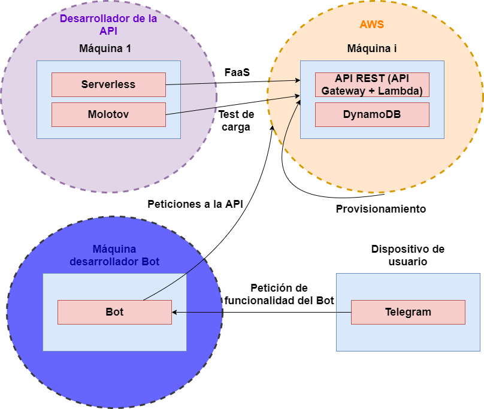

# Serverless token API with AWS 

## Overview
It is a simple API that allows the quick management of tokens used to associate 2 entities. This facilitates the work of the application developer by externalising this functionality and avoiding the need to manage a DB exclusively for this purpose. 
The deployment of the application in the cloud is done using Amazon's AWS service and the Serverless framework. Serverless allows this API to be organised through a FaaS architecture and thus consume cloud computing resources only when necessary.
Finally, to verify the full functionality of the API, a load test with Molotov and a user interface (use case) with a Telegram bot have been developed.

The proposed architecture can be seen in the following diagram:

## Previous considerations

This project was developed as a final project for the master's degree course, in which a web application had to be developed that made use of various current technologies seen in class. Therefore, this project is a test case of these technologies that can be used as a base, not a final product, so I am not responsible for its malfunctioning.I accept suggestions and, in case of detecting any failure, open an incidence in order to fix it.

## Architecture in detail

- **API REST**

    The API consists of 4 basic endpoints that are separated in different python scripts, inside the [*actions*](actions) folder: create token, delete token, update token pairing and query token pairing. They all have the same structure: instance the DB, perform the operation on it and send the response to the user who called the endpoint. 

    The **boto3** library is used to manage the DB in AWS and **uuid** is used to create the tokens. In order to encode the information sent in the json of the response, a small separate function included in the [*decimalencoder.py*](actions/decimalencoder.py) script is created.

    The desired workflow to achieve the entity matching is shown in the following diagram:

    

- **Serverless and AWS**
 
    The [*serverless.yml*](serverless.yml) file is used to manage the API deployment via Serverless on AWS. It indicates (in order of appearance) the resources needed to deploy the application, the description of the endpoints that will be available and the links that will be used to access them, and the configuration of the DB that will be used to store the tokens and pairings.

    Of the DBs that AWS offered for deployment, it was decided to use DynamoDB, a non-relational DB that is fairly easy to define and manage. It consists of only 1 table with 3 fields: the token, the id of entity 1 and the id of entity 2. However, when declaring the table, it is enough to indicate which parameter will be the ID of each table entry, the rest can be defined on the fly.
    
    The urls to call the endpoints would be:

    - <BASE_URL>/create

    - <BASE_URL>/get/<id>

    - <BASE_URL>/update/<id>

    - <BASE_URL>/delete/<id>

    The entity ids would be in the urls, but the tokens would be sent via a json within the response. As for the base url, it will depend on the account created within the AWS website.

- **Telegram bot**

    The telegram bot will be used as a user interface and its mission will be to pair 2 chats to communicate with each other, without having to know each other directly, but through the bot. On this basis, filters for words, expressions, images, ... could be implemented. (but this is left to future developments).

    It has a command for each API endpoint to test: 

    - **/generateToken** -> creates a unique token and adds the id of the chat where the association has been invoked.

    - **/pair <token>** -> takes a token already created by another chat and associates it with the chat that invokes this command. This would leave a completed chat pairing (the chat that generated the token and the chat that used the pair command).

    - **/rememberToken <token>** -> indicates which chats are paired thanks to this token.

    - **/deleteToken <token>** -> removes the token and any chat association it may have had.

    In addition, it has the bot start command '/start' which contains all the information about the previous commands for the user.

- **Molotov test**

    Molotov allows a workload to be added to the REST API in order to test the reliability of the infrastructure. It performs 2 types of tests: create a token, query it and complete the pairing or create the token, query it and delete it. Both tests have a 50% probability of being executed in each iteration of the test and the time it takes for the service to respond is measured in order to, at the end of the test, indicate the average response time to the requests.

## Deployment and use

1. Sign up with AWS to access the service.

2. Sign up as a developer on Telegram.

3. Configurar los parámetros propios del desarrollador:

    - **YOUT_BASE_URL** en la línea 10 de [*molotov_test.py*](molotov_test.py) y **YOUR_AWS_BASE_URL** en la línea 29 de [*bot.py*](bot.py). Debe de añadir la URL base que te dan al inscribir la aplicación en AWS.

    - **YOUR_TOKEN_ID** en la línea 11 de [*bot.py*](bot.py) con el token con el que des de alta al bot en Telegram.

4. Install serverless and serverless-aws pluggin, and add the developer credentials on the machine (*~/.aws/credentials*).

5. Install the necessary Python libraries.

6. Deploy the REST API with the next command in the same directory as the yml file:
*serverless deploy*

From here you can test by calling the endpoints. There are 2 ways to do this:

- Running the telegram bot (execute the script).

- Running the Molotov load test with the command:
*molotov -r 10 molotov_test.py*.

## Licence

This project is licensed under the GPL License
Copyright © Daniel Casanueva Morato

